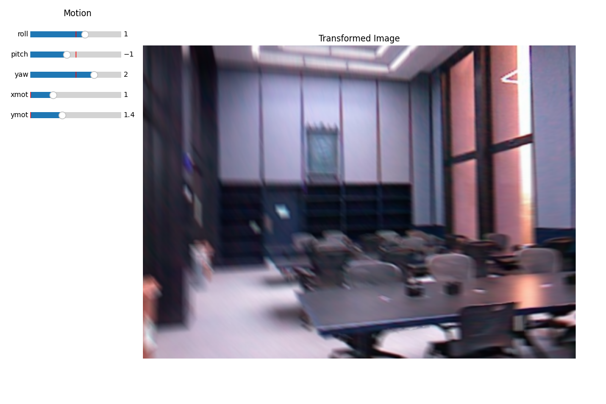

### Deblurring Dataset

This repo consists of blurred images suitable for a deblurring task. There are three difficulty levels:

1. **Spatially invariant non-blind deconvolution**: In this level, the kernel and its parameters are given (e.g. Gaussian(mu, sig_sq)), and the task is to recover the unblurred image. The dataset consists of images blurred with different types of kernels, such as box, triangle, and gaussian filters, and pixel horiz/vert motion blur.

    Derived from the [DIV2K dataset](https://data.vision.ee.ethz.ch/cvl/DIV2K/).

2. **Spatially variant blind deconvolution**: In this level, the blur parameters are not consistent throughout the image, and depend on the depth/place in the image. Synthetic rotational and linear motion is applied to still images to produce a blurred image. However, the exact parameters of motion used to blur the image should not be given, and must be estimated. The depth map can be given, optionally.

    Derived from the [NYU_depth_v2 dataset](https://cs.nyu.edu/~fergus/datasets/nyu_depth_v2.html).

3. **Spatially variant blind deconvolution + dynamic scenes**: In this level, a high-FPS camera captured videos at 240 FPS. The blurred image given to the student is computed by averaging eight frames together (four before the key-frame, four after the key-frame), as if this image was taken by a camera operating at 30 FPS. This image contains motion blur due to camera motion and object motion within the scene.

    Dervied from this [GOPRO dataset](https://seungjunnah.github.io/Datasets/gopro.html).

You can find examples of blurred imagery and their unblurred counterparts in `data/level<>/saved_images`, where `<>` is either 1, 2, or 3.

### Generating a Deblurring Dataset

The software to generate blurred images is provided, and is straightforward to use. 
Run `python3 main.py <LEVEL_NUM>`, where `LEVEL_NUM` is either 1, 2 or 3. An interactive tool will pop up.

You can use the sliders on the left and following keys to interact with the window:
- `n` to cycle to the next image in the dataset.
- `b` to cycle to the previous image in the dataset
- `c` to capture the transformed image and its ground truth. The imagery will be saved in `data/level<>/saved_images`, and the filename will include all of the transform parameters.
- `r` to reset the transform parameters.
- `t` to cycle to the next filter (only useful for level 1)

### Evaluating the Performance of Deblurring Algorithms
To quantify the performance of a deblurring solution, you can run `eval.py` with the deblurred and the ground truth imagery. It will output the PSNR and SSIM scores.